# Minimarket "Bora Bora" Web App
Este proyecto consiste en una aplicación web de catálogo para el Minimarket "Bora Bora". El objetivo principal es permitir a los clientes acceder al catálogo de productos desde la comodidad de sus hogares, además de proporcionar una herramienta de gestión y administración del almacén para el personal autorizado.

## Curso de Gestión de Proyectos
Este proyecto fue desarrollado como parte del curso de Gestión de Proyectos de Tecnología de Información - IDAT.

## Autores
* Jefferson Ferre
* Jhon Flores
* Carlos Acosta
* Brigitte Prieto 

## Objetivo
Facilitar a los clientes el acceso a los productos más frecuentes del Minimarket desde la comunidad de sus hogares. Además, brindar al administrador del Minimarket una plataforma para gestionar y administrar eficientemente el almacén.

## Características Principales
* Catálogo de productos para clientes.
* Cuentas de clientes para acceso personalizado.
* Sistema de gestión y administración del almacén para el personal autorizado.

## Tecnologías Utilizadas
Frontend: HTML, CSS, JavaScript, JSTL.
Backend: Java, Spring Boot, base de datos MySQL.

# Capturas de pantalla
| 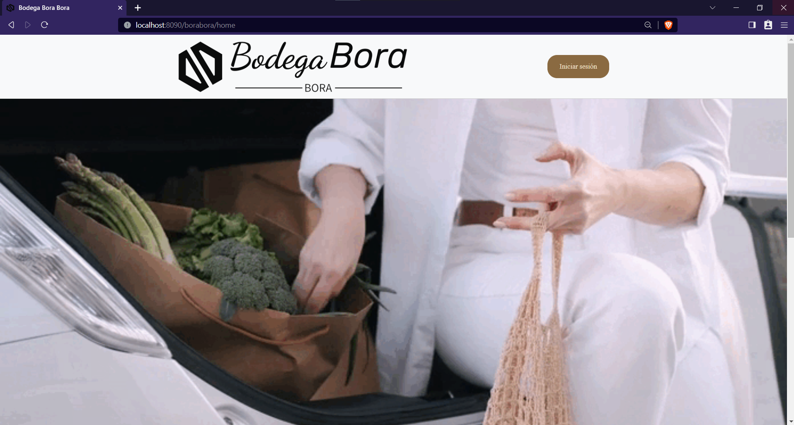 | 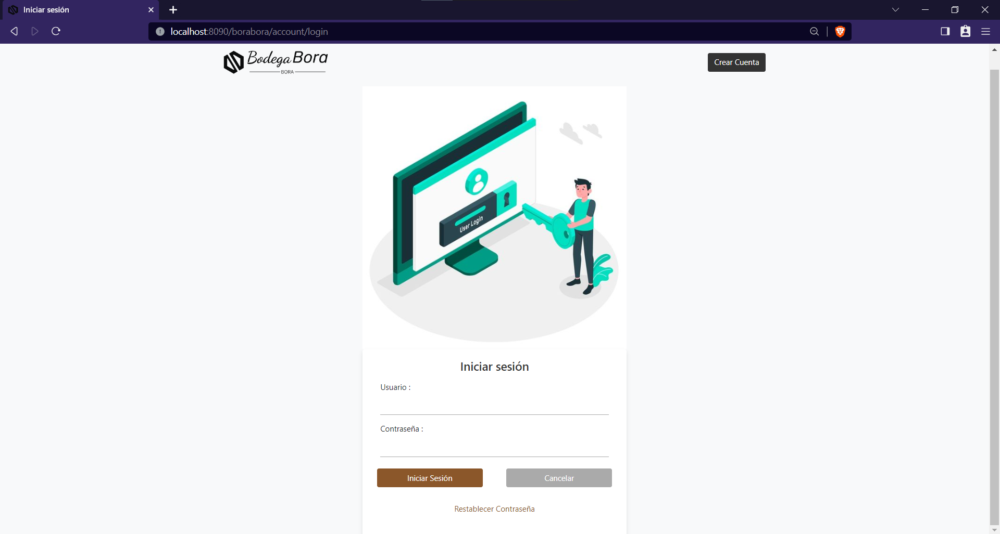 |
|---|---|
| 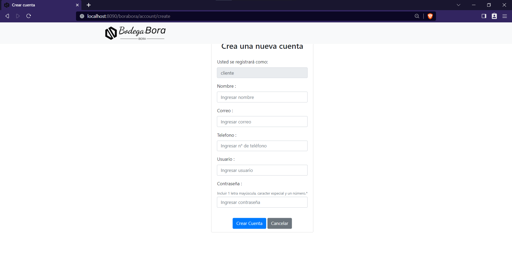 | 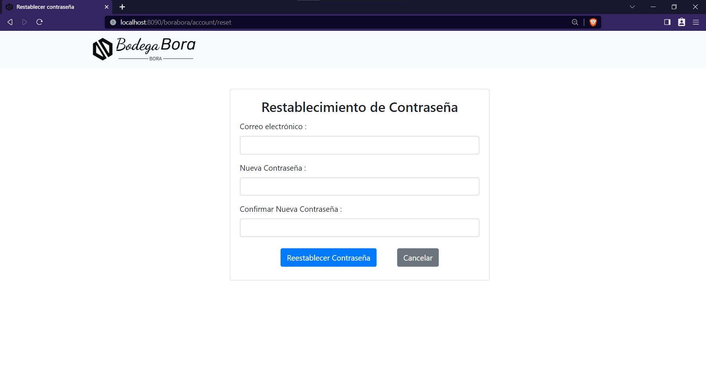 |

| Cliente                           | Admin                                     |
| --------------------------------- | ----------------------------------------- |
| 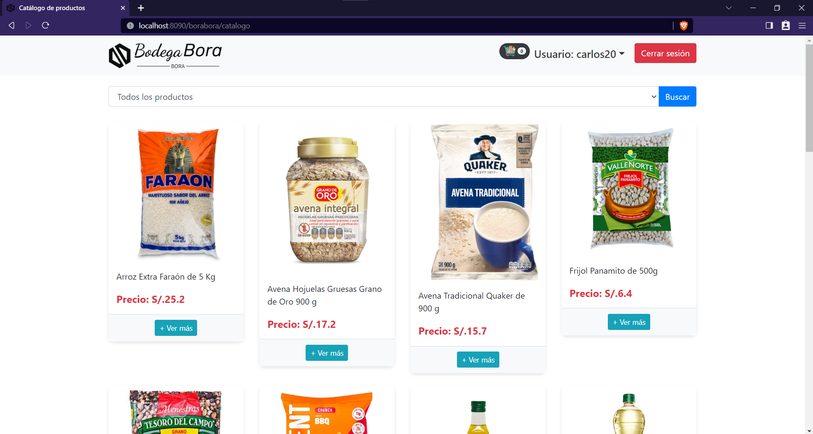      | 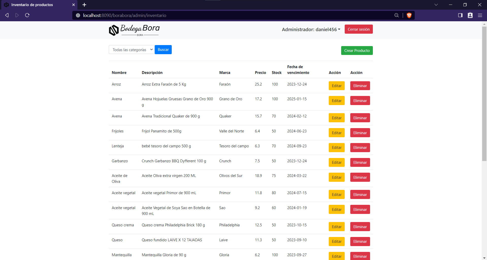  |
| 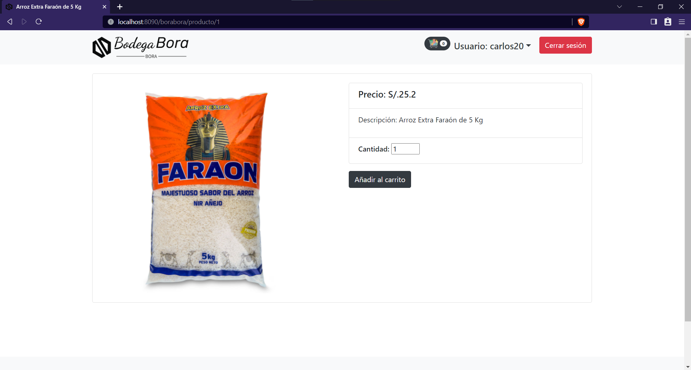         | 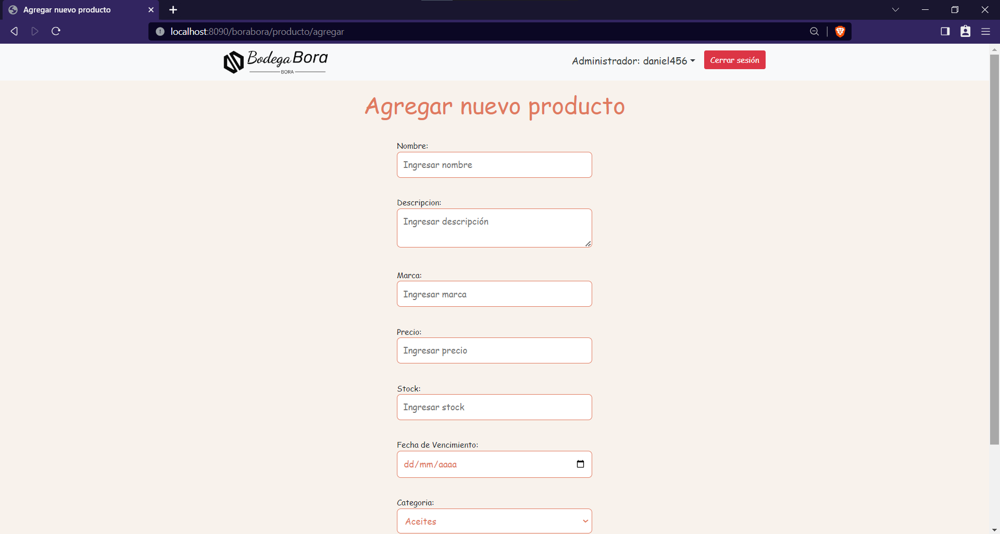  |
| 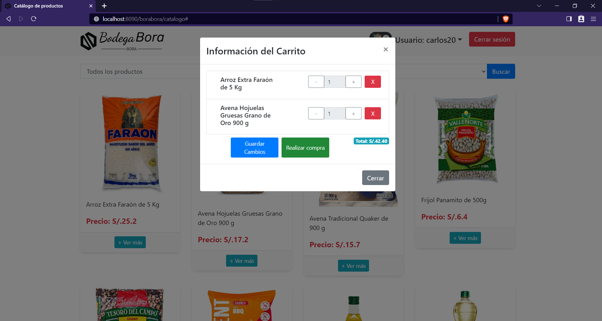         | 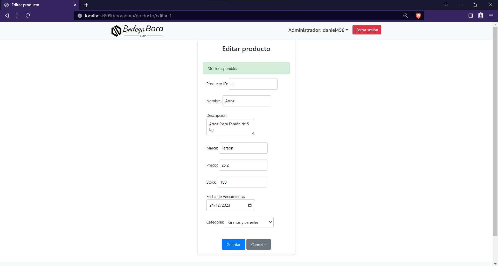|
| 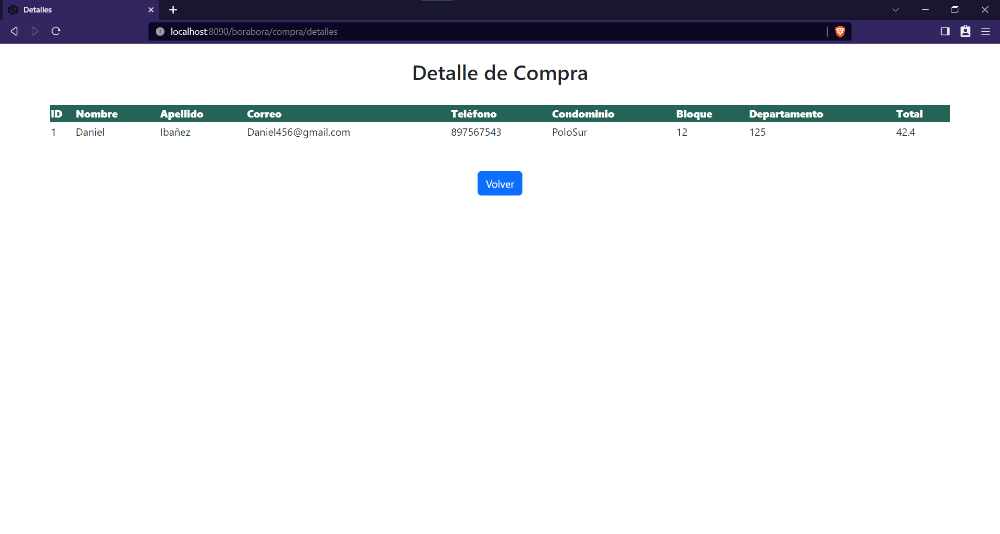 | 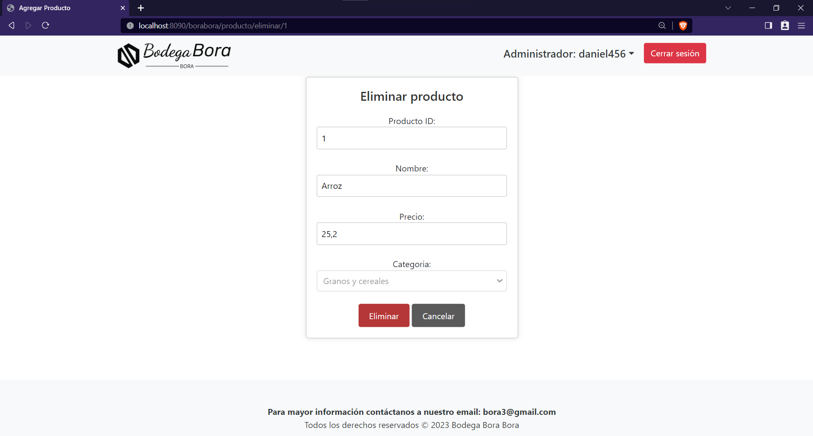|

